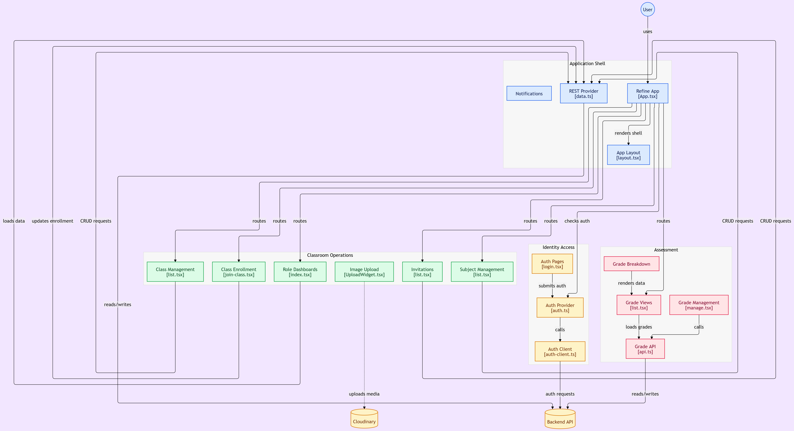

# Classly Frontend

## Flow Chart


Web UI for **Classly**, a role-based classroom management app. Admins manage the catalog and users, teachers run classes and grades, and students join classes and view published scores.

Built with React, Vite, and [Refine](https://refine.dev), talking to the Express/Drizzle backend over cookie-based sessions.

## Architecture

```
┌──────────────────────────────────────────────────────────┐
│  React 19 + Vite + Refine                                │
│  ├─ App.tsx          resources + routes                  │
│  ├─ providers/       authProvider + REST dataProvider    │
│  ├─ lib/auth-client  better-auth (session cookies)       │
│  └─ pages/           dashboards, subjects, classes, …    │
└────────────────────────────┬─────────────────────────────┘
                             │
         credentials: include │  /api/*
                             ▼
              Backend (proxied same-origin)
```

**Auth & data flow**

1. Sign-in / sign-up via better-auth → HTTP-only session cookie.
2. Refine `authProvider` checks session and identity (including role).
3. Refine `dataProvider` hits `${BACKEND_URL}/api/` for list/create/show resources.
4. Custom fetches in `lib/api.ts` cover dashboard summary and grade CRUD.
5. Role gates nav (`lib/access.ts`) and routes (`RequireRole`).

**Why proxy `/api`?** Session cookies use `SameSite=Lax`. Serving the API under the frontend origin (Vite in dev, Vercel rewrite in prod) keeps cookies first-party and avoids mobile Safari blocking cross-site cookies.

### Stack

| Layer | Choice |
|--------|--------|
| UI | React 19 + Vite 6 |
| App framework | Refine (REST, React Router, React Table, Hook Form) |
| Routing | React Router 7 via `@refinedev/react-router` |
| Styling | Tailwind CSS 4 + shadcn/Radix |
| Auth client | better-auth/react |
| Forms / validation | react-hook-form + zod |
| Uploads | Cloudinary (class banners / avatars) |
| Charts | recharts |

### Roles & features

| Role | Capabilities |
|------|----------------|
| **Admin** | Subjects, create classes, invites, org-wide grade views, dashboard stats |
| **Teacher** | Own classes, enrollments, weighted grade items & scores, invites |
| **Student** | Join by invite code, view enrollments & published grades |

Domain coverage: departments → subjects → classes → enrollments → invites → weighted grades. No attendance module.

### Project layout

```
classroom-frontend/
├── src/
│   ├── App.tsx                 # Refine resources + route tree
│   ├── constants/              # BACKEND_URL, roles, Cloudinary
│   ├── lib/
│   │   ├── auth-client.ts      # better-auth client
│   │   ├── api.ts              # dashboard + grades helpers
│   │   ├── access.ts           # role → nav permissions
│   │   └── …                   # schemas, grades math, Cloudinary
│   ├── providers/
│   │   ├── auth.ts             # Refine AuthProvider
│   │   └── data.ts             # REST dataProvider → /api/
│   ├── pages/                  # login, dashboard, subjects, classes, grades, invites
│   └── components/             # layout, shadcn UI, RequireRole, UploadWidget
├── vite.config.ts              # /api → localhost:8000 proxy
├── vercel.json                 # SPA + /api rewrite to Workers
└── Dockerfile                  # optional static serve of dist/
```

### Main routes

| Path | Purpose |
|------|---------|
| `/` | Role-specific dashboard |
| `/subjects`, `/subjects/create` | Subject catalog |
| `/classes`, `/classes/create`, `/classes/show/:id` | Classes |
| `/classes/show/:id/grades` | Teacher grade management |
| `/grades`, `/grades/:classId` | Grades list / student view |
| `/grades/class/:classId`, `.../student/:studentId` | Admin grade views |
| `/invites`, `/invites/create` | Email invitations |
| `/join-class` | Student join via invite code |
| `/login`, `/register`, `/forgot-password`, `/reset-password` | Auth |
| `/accept-invite` | Accept invite token |

## Getting started

Run the [backend](../classroom-backend) first (default `http://localhost:8000`).

```bash
cd classroom-frontend
npm install
cp .env.example .env          # fill in values
npm run dev                   # typically http://localhost:5173
```

Vite proxies `/api` → `http://localhost:8000`. Align backend `FRONTEND_URL` and `BETTER_AUTH_URL` with the frontend origin (e.g. `http://localhost:5173`) when using the proxy.

### Environment

| Variable | Purpose |
|----------|---------|
| `VITE_BACKEND_URL` | API origin in development (e.g. `http://localhost:8000`) |
| `VITE_CLOUDINARY_UPLOAD_URL` | Cloudinary upload endpoint |
| `VITE_CLOUDINARY_CLOUD_NAME` | Cloud name |
| `VITE_CLOUDINARY_UPLOAD_PRESET` | Unsigned upload preset |

In production builds, `BACKEND_URL` is `window.location.origin` so the Vercel `/api` rewrite is used. `VITE_API_URL` is a leftover Refine template value and is not the live Classly API.

## Scripts

| Script | Description |
|--------|-------------|
| `npm run dev` | Refine / Vite development server |
| `npm run build` | Typecheck + production build |
| `npm run start` | Serve the production build |

## Deploy

- **Primary:** Vercel. `vercel.json` rewrites SPA routes to `index.html` and proxies `/api/*` to the Cloudflare Worker backend.
- **Optional:** `Dockerfile` builds the Refine app and serves `dist/` with a static server.

After a backend Worker deploy, update the `/api` destination in `vercel.json` (or use the backend `npm run cf:update-vercel` helper).

## How it connects to the backend

| Concern | Mechanism |
|---------|-----------|
| API base | Dev: `VITE_BACKEND_URL`; Prod: page origin + `/api` proxy |
| Auth | better-auth cookie sessions (`credentials: "include"`) |
| Data | Refine REST provider → `/api/subjects`, `/api/classes`, etc. |
| CORS | Backend allows `FRONTEND_URL` with credentials |

Sibling package: [`classroom-backend`](../classroom-backend).
